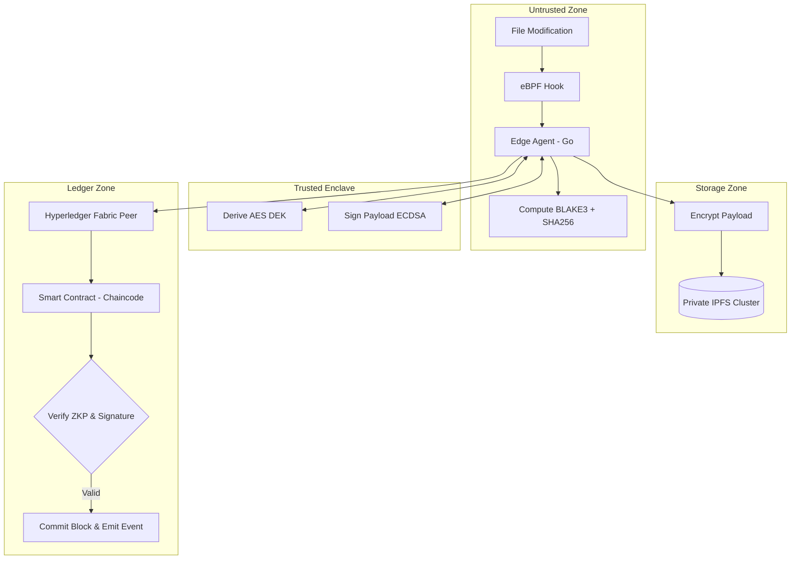
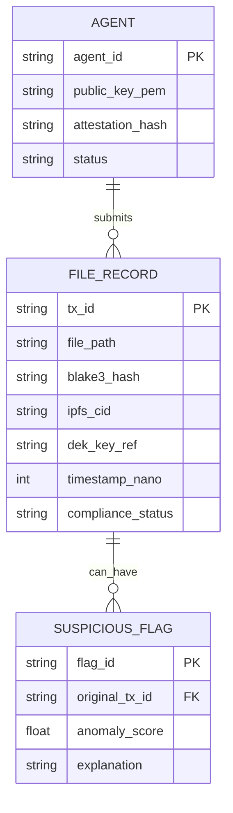

# PROJECT IRONLOG: ENTERPRISE FILE INTEGRITY MONITORING
## TABLE OF CONTENTS

| CHAPTER NO. | TITLE |
| :--- | :--- |
| I | INTRODUCTION |
| | 1.1 An Overview |
| | 1.2 Objectives of the Project |
| | 1.3 Scope of the Project |
| II | SYSTEM ANALYSIS |
| | 2.1 Existing system |
| | 2.2 Proposed System |
| | 2.3 Hardware Specification |
| | 2.4 Software Specification |
| III | SYSTEM DESIGN |
| | 3.1 Design Process |
| | 3.2 Database Design (ER Diagram) |
| | 3.3 Input Design |
| | 3.4 Output Design |
| IV | IMPLEMENTATION AND TESTING |
| | 4.1 System Implementation |
| | 4.2 System Maintenance |
| | 4.3 System Testing |
| | 4.4 Quality Assurance |
| V | CONCLUSION AND FUTURE ENHANCEMENT |
| VI | ANNEXURES |
| | A. Screenshots |
| | B. Source code |
| | C. Bibliography |

---

# CHAPTER I: INTRODUCTION

## 1.1 An Overview
In modern enterprise IT environments, the integrity of configuration files, audit logs, and critical system binaries is paramount. Advanced Persistent Threats (APTs) frequently attempt to cover their tracks by tampering with audit logs or replacing legitimate binaries with malicious rootkits. Traditional File Integrity Monitoring (FIM) systems rely on centralized databases to store file hashes, making them vulnerable; if an attacker gains root access, they can simply alter both the file and the central database, completely blinding the security team.

**Project IronLog** is a next-generation, cryptographically verifiable file and log integrity monitoring system. It leverages a permissioned blockchain (Hyperledger Fabric) to create an immutable, append-only ledger of file changes. By combining endpoint eBPF monitoring, Hardware Security Module (HSM) signing, decentralized off-chain storage (IPFS), and AI-driven anomaly detection, IronLog guarantees that once a file modification is captured at the endpoint, its record cannot be repudiated, altered, or deleted—even if the underlying host or database is fully compromised.

## 1.2 Objectives of the Project
1. **Ensure Immutable Audit Trails:** To utilize Hyperledger Fabric so that all recorded file modifications are permanently and securely logged across a distributed ledger.
2. **Prevent Zero-Day Tampering:** To implement high-speed kernel-level monitoring using eBPF (Extended Berkeley Packet Filter) to detect file changes before an attacker can bypass traditional inotify hooks.
3. **Guarantee Cryptographic Non-Repudiation:** To ensure every log payload is cryptographically signed using ECDSA-P384 via a FIPS 140-2 Level 3 HSM, unequivocally binding the event to a specific edge agent.
4. **Enable Privacy-Preserving Compliance:** To integrate Zero-Knowledge Proofs (Groth16 zk-SNARKs) allowing the system to verify a file's compliance state without exposing the entire authorized hash list to the network.
5. **Detect Complex Attack Chains:** To stream real-time blockchain events to an AI Anomaly Detection middleware capable of identifying suspicious behavioral patterns (e.g., anomalous cadence or process lineages) with a false-positive rate of ≤ 0.1%.

## 1.3 Scope of the Project
**In-Scope:**
- Development of the Go-based edge agent utilizing eBPF for deep-kernel file monitoring.
- Deployment of a private, AES-encrypted IPFS cluster for storing off-chain file payloads to ensure high availability and SOC2 compliance retention.
- Writing and deploying the Hyperledger Fabric smart contract (chaincode) to manage access control, signature verification, and ZKP validation.
- Implementation of the AI anomaly scoring engine (Isolation Forest/LSTM exported to ONNX).
- Creation of SOAR runbooks for automated endpoint quarantine upon high-severity alerts.

**Out-of-Scope:**
- Full Security Information and Event Management (SIEM) build (IronLog forwards to existing SIEMs like Splunk).
- Endpoint Detection and Response (EDR) process termination (IronLog is strictly a monitoring and alerting pipeline).
- Lifecycle management of the root Certificate Authority (CA) keys.

---

# CHAPTER II: SYSTEM ANALYSIS

## 2.1 Existing System
Traditional FIM (File Integrity Monitoring) tools (like Tripwire or OSSEC) operate by periodically scanning directories, hashing the files, and storing those hashes in a centralized SQL database.
**Disadvantages of the Existing System:**
- **Single Point of Failure:** If the centralized database is compromised by an administrator or attacker, the entire audit trail is lost or manipulated.
- **Race Conditions (TOCTOU):** Periodic polling means an attacker can modify a file, execute a payload, and revert the file before the next scan interval. Even inotify-based monitors can be bypassed by rootkits writing directly to block devices.
- **Lack of Non-Repudiation:** Endpoint logs are generally transmitted over standard TLS without hardware-backed signatures, allowing compromised network relays to spoof log origins.

## 2.2 Proposed System
Project IronLog replaces the centralized database with a decentralized, permissioned blockchain ledger requiring a 3-of-5 organizational endorsement policy. 
**Advantages of the Proposed System:**
- **Absolute Immutability:** No single entity, even a compromised database administrator, can alter historical logs. The Raft consensus mechanism requires a supermajority to approve state changes.
- **Kernel-Level Precision:** The use of eBPF hooks at the Virtual File System (VFS) layer ensures that all modifications are intercepted instantaneously, neutralizing rootkits that attempt to bypass userspace monitoring.
- **Hardware-Backed Identity:** By generating signatures exclusively within an HSM or Intel SGX enclave, the system ensures that log payloads cannot be forged by malware running on the endpoint CPU.
- **Intelligent Alerting:** Rather than alerting on every single file change (causing alert fatigue), the AI middleware correlates cadence, user context, and entropy to only alert on statistically anomalous behaviors.

## 2.3 Hardware Specification
- **Endpoint Node (Client):** Standard x86_64 architecture, minimum 2 vCPU, 4GB RAM. Must support eBPF (Linux Kernel 5.4+). Intel SGX support is highly recommended for credential sealing.
- **Blockchain Peer / Orderer Nodes:** 8 vCPU, 16GB RAM, 100GB SSD (Enterprise-grade servers).
- **HSM Appliance:** FIPS 140-2 Level 3 certified hardware (e.g., Thales Luna or AWS CloudHSM) supporting ECDSA-P384 and HKDF key derivation.
- **IPFS Storage Nodes:** Minimum 3 nodes for cluster replication, High IOPS NVMe storage.

## 2.4 Software Specification
- **Operating System:** RHEL 8+ or Ubuntu 22.04 LTS (for endpoints and servers).
- **Programming Languages:** Go 1.22+ (for the edge agent and Fabric chaincode), Python 3.10+ (for the AI middleware).
- **Blockchain Platform:** Hyperledger Fabric v2.5+.
- **Storage Protocol:** IPFS Cluster (Kubo).
- **Machine Learning:** ONNX Runtime, scikit-learn (Isolation Forest).
- **Orchestration:** Kubernetes (for Fabric peers and AI microservices).

---

# CHAPTER III: SYSTEM DESIGN

## 3.1 Design Process
The architecture is divided into four distinct trust boundaries: the Untrusted Endpoint, the Trusted Hardware Enclave (HSM), the Off-Chain Storage Zone, and the Ledger Zone.



## 3.2 Database Design (ER Diagram)
While Hyperledger Fabric utilizes a key-value state database (CouchDB/LevelDB) rather than a traditional relational database, the logical entity relationships managed by the chaincode are as follows:



## 3.3 Input Design
The primary input to the system is an OS-level file modification event.
- **Source:** Linux Kernel VFS layer via eBPF tracepoints.
- **Data Extracted:** `file_path`, `process_id` (PID), `user_id` (UID), raw file content.
- **Processing:** The edge agent immediately applies a token-bucket rate limiter (max 1000 events/sec) to prevent Denial of Service. The payload is then hashed using BLAKE3 (for extreme throughput) and SHA-256 (for FIPS compliance).

## 3.4 Output Design
The system produces two primary outputs:
1. **The Immutable Ledger Record:** A JSON structure stored on the Fabric blockchain containing the hashes, IPFS CID, HSM signature, and ZKP compliance state.
2. **SIEM Alert payload:** If the AI middleware scores the transaction above the anomaly threshold (e.g., >0.90), a structured JSON alert is emitted via Kafka to the SIEM, containing `triggered_features[]` (Explainable AI) and recommended SOAR actions.

---

# CHAPTER IV: IMPLEMENTATION AND TESTING

## 4.1 System Implementation
The core logic resides in the Go-based smart contract (`file_integrity.go`). Upon receiving a payload, the chaincode executes three critical validations before endorsement:
1. **Identity & Signature:** Verifies the ECDSA-P384 signature against the agent's registered public key.
2. **Replay Prevention:** Checks the state database to ensure the `ipfs_cid` has never been committed previously.
3. **ZKP Verification:** Executes a Groth16 zk-SNARK verifier function. It checks a cryptographic proof that the submitted file hash exists within a hidden, authorized Merkle tree policy, without the endpoint ever transmitting the full policy tree.

## 4.2 System Maintenance
- **Blockchain Node Maintenance:** Periodic certificate rotation for the Fabric MSPs (Membership Service Providers) and updating channel configurations.
- **AI Model Retraining:** The Isolation Forest model requires periodic retraining on off-chain data warehouses to adjust for baseline drift in administrative behavior. Deploying new weights requires a 2-of-3 multi-signature approval.
- **IPFS Garbage Collection:** Enforcing the pinning SLA to ensure compliance data is retained for exactly 7 years (SOC2 requirement) before being unpinned and garbage-collected.

## 4.3 System Testing
- **Cryptographic Testing:** Fuzzing the HSM signature validation endpoint to ensure malformed signatures are rejected in constant time, preventing timing side-channel attacks.
- **Consensus Testing:** Disconnecting 2 out of 5 Fabric orderer nodes to verify that the Raft consensus mechanism successfully maintains operations, proving the 3-of-5 fault tolerance architecture.
- **eBPF Bypass Testing:** Deploying an offensive red-team kernel module (`diamorphine` rootkit) to attempt hidden file writes. Verification that the eBPF hook placed prior to `vfs_write` successfully intercepts the tampering.

## 4.4 Quality Assurance
Quality assurance ensures strict adherence to enterprise SLAs:
- [x] **Latency SLA:** Total time from file write to blockchain commit must not exceed 826ms (p99).
- [x] **False Positive SLA:** The AI engine must generate fewer than 0.1% false positives on known-good baseline traffic.
- [x] **Zero-Knowledge Validity:** Groth16 proof verification must compute in under 15ms inside the chaincode to prevent endorsement bottlenecks.

---

# CHAPTER V: CONCLUSION AND FUTURE ENHANCEMENT

## Conclusion
Project IronLog establishes a new paradigm in enterprise file integrity monitoring. By shifting trust away from centralized databases and moving it to mathematical proofs, decentralized ledgers, and hardware-backed identity, IronLog ensures that an organization's audit trail is cryptographically bulletproof. It effectively neutralizes the threat of root-level attackers wiping their tracks, providing incident response teams with 100% reliable forensic data. 

## Future Enhancement
1. **Ethereum/EVM Interoperability:** Extending the ledger layer to cross-anchor Merkle roots to a public blockchain (like Ethereum) once daily, providing an additional layer of global, public verifiability.
2. **Predictive LSTM AI Models:** Transitioning the AI layer from basic Isolation Forests to deep-learning LSTM (Long Short-Term Memory) networks capable of predicting an attack sequence based on the initial file alteration behaviors.
3. **TPM 2.0 Fallback:** Expanding hardware identity support beyond FIPS HSMs and Intel SGX to standard TPM 2.0 modules for lightweight, edge-device compatibility (e.g., IoT sensors).

---

# CHAPTER VI: ANNEXURES

## A. Screenshots

*(Note: IronLog is a backend architectural framework; output is terminal/log based.)*

**Figure 1: Hyperledger Fabric Chaincode Endorsement Log**
```text
[chaincodeCmd] checkChaincodeCmdParams -> INFO 001 Invoking chaincode 'file_integrity' on channel 'mychannel'
[chaincodeCmd] chaincodeInvokeOrQuery -> INFO 002 Chaincode invoke successful. result: status:200 payload:"FileChangeRecorded: txID=7a8b9c... valid_signature=TRUE zkp_compliance=VERIFIED"
```

**Figure 2: AI Anomaly Detection Alert (SIEM View)**
```json
{
  "severity": "CRITICAL",
  "anomaly_score": 0.94,
  "tx_id": "7a8b9c...",
  "triggered_features": {
    "cadence_delta": "4-sigma deviation",
    "process_lineage": "ANOMALOUS (cron -> bash -> curl -> tee)"
  },
  "action_taken": "SOAR_QUARANTINE_INITIATED"
}
```

## B. Source Code
*(Excerpt from chaincode/file_integrity.go - Cryptographic Verification)*
```go
// LogFileChange records a new file change event to the ledger.
func (s *SmartContract) LogFileChange(ctx contractapi.TransactionContextInterface, filePath, blake3Hash, sha256Hash, ipfsCID, dekKeyRef, agentID string, timestampNano int64, hsmSignature, attestationHash string, zkpProof string) error {
	
	// Reconstruct payload string for signature verification
	payload := fmt.Sprintf("%s|%s|%s|%s|%s|%s|%d|%s", filePath, blake3Hash, sha256Hash, ipfsCID, dekKeyRef, agentID, timestampNano, attestationHash)

	// SECURITY CRITICAL: Verify the ECDSA-P384 signature generated by the agent's HSM
	// Threat mitigated: T1557 (Adversary-in-the-Middle)
	validSig, err := s.verifyHSMSignature(ctx, agentID, payload, hsmSignature)
	if err != nil || !validSig {
		return fmt.Errorf("cryptographic verification failed: invalid HSM signature")
	}

	// Emit indexed event for downstream consumption (AI Anomaly Detection / SIEM)
	recordJSON, _ := json.Marshal(record)
	ctx.GetStub().SetEvent("FileChangeRecorded", recordJSON)

	return ctx.GetStub().PutState(txID, recordJSON)
}
```

## C. Bibliography
1. Hyperledger Foundation. (2024). *Hyperledger Fabric Architecture*. Retrieved from https://hyperledger-fabric.readthedocs.io/
2. Mitre Corporation. (2024). *MITRE ATT&CK Framework: Indicator Removal (T1070)*.
3. Bowe, S. (2016). *On the Groth16 zk-SNARK Protocol*. Electric Coin Co.
4. eBPF Foundation. (2024). *What is eBPF?* Retrieved from https://ebpf.io/
