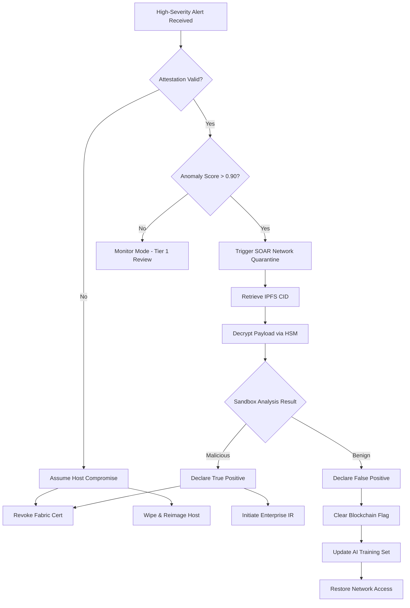

# Project IronLog — Operational Runbook

> **Document Type:** Standard Operating Procedure (SOP)  
> **Trigger:** High-Severity Alert from AI Anomaly Detection Middleware  
> **Target Audience:** SOC Tier-1 / Tier-2 Analysts  

---

## 1. Initial Triage & Validation

When the SIEM receives an `ALERT` event from the AI Zone, verify the context before containment.

1. **Review the AI Explainability Output:**
   - Locate the `triggered_features[]` array in the alert payload.
   - *Example:* If `cadence_delta` is the primary trigger, verify if a scheduled maintenance window (e.g., cron job update) is active.
2. **Verify Agent Attestation Status:**
   - Query the SGX remote attestation server to ensure the agent's `attestation_token` is still valid.
   - If attestation has failed, assume the host is fully compromised (kernel-level rootkit).
3. **Cross-Reference Threat Intel:**
   - Check the flagged `file_path` against known CVE targets (e.g., `/etc/shadow`, `/var/log/auth.log`).

## 2. Endpoint Isolation

If the anomaly score is > 0.90 or involves a critical file tier (Tier 5):

1. **Network Quarantine (SOAR Automated):**
   - Execute the SOAR playbook to assign the endpoint to the `Quarantine` VLAN via the NAC/Switch.
   - The quarantine VLAN permits ONLY outbound connections to the SIEM and Fabric Peer (to maintain the audit trail).
2. **Agent Lockdown:**
   - Send an OOB management command to the eBPF agent to enter `LOCKDOWN` mode.
   - In `LOCKDOWN` mode, the agent drops the rate limiter token bucket to 0, pausing all non-critical hashing to preserve CPU for forensic capture.

## 3. Blockchain Record Integrity Verification

Verify that the ledger matches the alert.

1. **Query Fabric Ledger by TXID:**
   ```bash
   peer chaincode query -C tenant-channel -n file_integrity -c '{"Args":["GetRecord", "<original_tx_id>"]}'
   ```
2. **Validate the SuspiciousFlag:**
   - Confirm that the `FlagSuspiciousChange` transaction was successfully endorsed and committed, attaching the AI explanation to the original record.
3. **Check Compliance Status:**
   - Confirm the record's `compliance_status` has transitioned from `COMPLIANT` to `UNDER_INVESTIGATION`.

## 4. IPFS Forensic Recovery

Retrieve the encrypted file payload for malware analysis.

1. **Extract Key Material:**
   - Retrieve the `dek_key_ref` from the blockchain record.
   - Authenticate to HashiCorp Vault (or the HSM API) using SOC Tier-2 credentials to request the DEK unwrap operation.
2. **Fetch from IPFS:**
   ```bash
   ipfs cat <ipfs_cid> > encrypted_payload.bin
   ```
3. **Decrypt Payload:**
   - Decrypt `encrypted_payload.bin` using the unwrapped DEK and the authenticated data (AAD) `file_path || timestamp`.
   - Transfer the plaintext file to the isolated sandbox (Cuckoo/FireEye) for static and dynamic analysis.

## 5. Agent Re-Attestation & Recovery

If the alert is confirmed as a **False Positive**:

1. Re-run the SGX remote attestation protocol manually.
2. Invoke the Fabric chaincode to clear the `UNDER_INVESTIGATION` flag.
3. Remove the endpoint from the Quarantine VLAN.

If confirmed as a **True Positive** (System Compromised):

1. Do NOT re-attest. The endpoint must be wiped.
2. Revoke the agent's identity certificate in the Fabric CA.
3. Initiate incident response (IR) procedures for lateral movement detection.

---

## 6. Rollback Decision Tree


